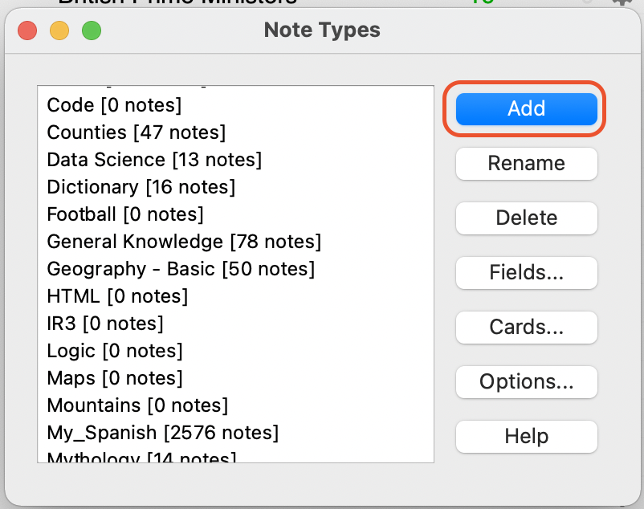
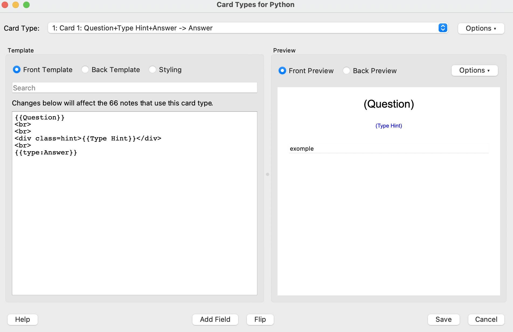
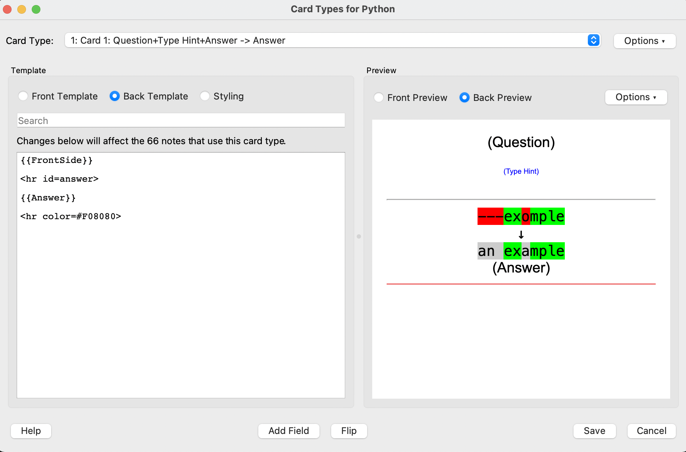
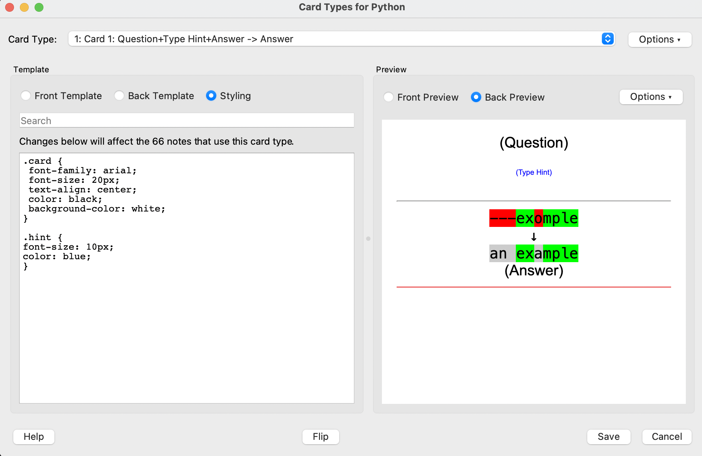

# Programming Anki Notes/Cards
This is a brief guide to setting up Programming notes/cards for Anki

### Creating a New Note Type
1. Navigate to *Tools -> Manage note types*
2. Click *Add* to make a new note type

3. Select *Add Basic* 

### Editing the Fields
Fields are basically bits of information associated with a note. The default is "Front" and "Back", however you can literally have anything you like. 

In the context of programming, I have the following fields setup:

For more information on customising fields, feel free to check out Anki's docs on the topic [here](https://docs.ankiweb.net/#/editing?id=customizing-fields)

### Editing the Card Templates
Cards are what you can think of as the digital equivalent of physical paper flash-cards. These cards are constructed in HTML & CSS, and pull in information from your "fields". 

When constructing my Python card template, I make the following changes...

